# 无记忆压缩算法
## 0.写在前面的话
本文着重在于介绍香农、费诺、哈夫曼3个无记忆压缩算法的操作过程和程序实现，不太细扣这些算法的原理。另外，本文会提到很多名词，如码字、码长、信息量、码树、唯一可译码、前缀码等概念，这里也不作解释了，可查阅《信息论与编码技术(第2版)》(冯桂等著，清华大学出版社，下文称作冯书)，及网络上其他相应资料。  
有一点提一下：  
这些算法能实现压缩的主要原因是采用不等长编码，结合各个字符出现的概率来决定其使用多少位bit来表示。而且，依据贪心算法的原理，出现次数最多的字符尽可能使用少的bit位来表示，出现次数少的字符可用较多的bit位来表示。
## 1.香农算法
**基本原理：**   
香农定理，即：`某字符携带的信息量 = log2 (1 / 该字符出现的概率)`，单位是`bit`。所以，我们可以通过统计待压缩的原文件得到每一种字符出现的概率，依上面公式，可得每一种字符其对应的码长。接着，就是由每种字符的码长来构造码树，实现编码。  
**步骤：**  
1. 统计待压缩文件，得到原符号集S及每种符号出现的概率。
2. 假设S的大小为q。将这q种符号按概率递减次序排列：  
	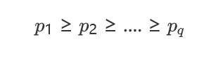  
3. 按如下公式计算出每个符号的码长`Li`  
	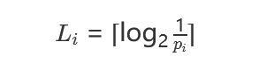  
4. 为了编成唯一可译码，计算第i种符号的累加概率：  
	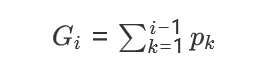  
这里解释一下唯一可译码，简单来说，就是不同的原符号要映射到不同的码字，这样就是唯一可译码。如果两种原符号A、B，都映射到同样的码字，后面解码就不能正常进行。  
5. 将累加概率`Gi`用二进制数表示
6. 取`Gi`对应二进制数的小数点后`Li`位构造该原符号的二进制码字
7.   
**示例**  
  

原符号|概率|累加概率`Gi`|`Gi`对应的二进制数|信息量|码长`Li`|码字  
--|--|--|--|--|--|--  
a1|0.20|0|0.000|2.34|3|000
a2|0.19|0.2|0.0011...|2.41|3|001
a3|0.18|0.39|0.0110...|2.48|3|011
a4|0.17|0.57|0.1001...|2.56|3|100
a5|0.15|0.74|0.1011...|2.74|3|101
a6|0.10|0.89|0.1110...|3.34|4|1110
a7|0.01|0.99|0.1111110...|6.66|7|1111110

**改进**  
上面的步骤稍稍修改自冯书，其给出一种由码长得到码字的方法，但这个方法并不便于编程实现，一是求概率和后面概率累加在程序中有精度的限制，二是求`log`会有较高的时间消耗。嗯，通往罗马的路不止一条。由码长到码字且确保唯一可译、两两码字互不为前缀的方法也不止一种。我自己想出了一种方法，可供大家参考。仍旧是上面的例子。假设各码长均以求得，按码长递增次序排序。

原符号|码长`Li`|码字
--|--|--
a1|3|000
a2|3|001
a3|3|010
a4|3|011
a5|3|100
a6|4|1010
a7|7|1011000

码字怎么得来的呢？
```C++
void fun()
{
	size_t CodeLen[7] = {3,3,3,3,3,4,7}; //码长数组
	uint32_t Code[7];//码字数组，但还得结合CodeLen才能真正确定码字
	uint32_t u = 0;
	size_t len = CodeLen[0];
	for (size_t i = 0;i < 7;i++) {
		u <<= (CodeLen[i] - len); 
		Code[i] = u;
		u++;
	}
}
```
上面函数做完，`Code = {0,1,2,3,4,10,88}`，取`Code[i]`的二进制表示的后`CodeLen[i]`便是对应的码字。  
如何得到码长？或者说我是如何不调用`cmath`的`log2`函数来求码长？  
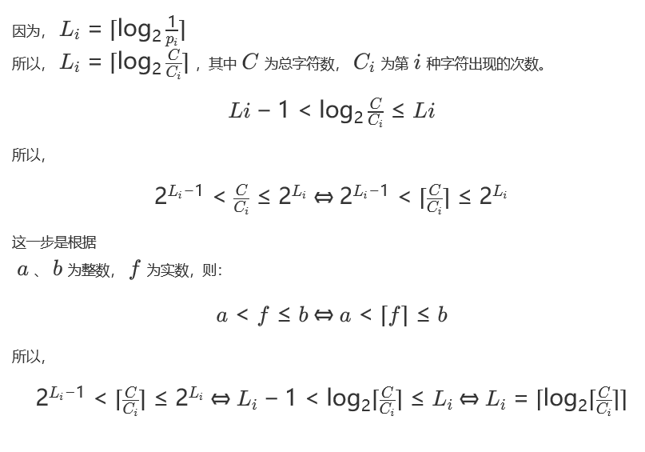  
很容易我们可以求出`ceil(c/ci)`(ceil表示向上取整)。然后，再看看下面这一函数：
```C++
//向上取整(log2(x))，对x以2为底的对数向上取整
//作用相当于 (unsigned)ceil(log2(x))
inline unsigned upper_int_log2(unsigned x)
{
	x--;
	if (x == 0)
		return 0;
	else {
		int n = 31;
		if (!(x >> 16)) {
			n -= 16;
			x <<= 16;
		}
		if (!(x >> 24)) {
			n -= 8;
			x <<= 8;
		}
		if (!(x >> 28)) {
			n -= 4;
			x <<= 4;
		}
		if (!(x >> 30)) {
			n -= 2;
			x <<= 2;
		}
		n += (x >> 31);
		return n;
	}
}
```
魔法位运算，不多解释。直接看看和`(unsigned)ceil(log2(x))`的耗时对比。
```C++
int main()
{
	srand(time(0));
	unsigned data[65536];
	for (unsigned& e : data) {
		e = rand() & UINT32_MAX;
	}
	clock_t start = clock();
	for (unsigned& e : data) {
		(unsigned)ceil(log2(e));
	}
	cout << (double)(clock() - start) / CLOCKS_PER_SEC << "s\n";
	start = clock();
	for (unsigned& e : data) {
		upper_int_log2(e);
	}
	cout << (double)(clock() - start) / CLOCKS_PER_SEC << "s\n";
	return 0;
}
```  
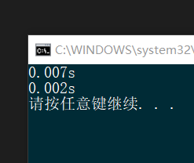  
到此，我们有了码字，当然就可以很容易地构造出码树了。  
**编程实现**     
最后，梳理一下编程实现的大概框架：  
1. 统计待压缩文件信息，包括总字符数、每种字符出现次数。嗯，我们知道在程序中字符最多有256种`(unsigned char 00000000-11111111)`。所以可用一个大小为256的`size_t`数组来实现。
2. 根据在改进部分介绍的，求各字符对应对的码长、码字。
3. 构造码树。
4. 将码树序列化后写入文件，用于解压缩时进行解码。
5. 将原文件内容按顺序逐一字符逐一字符地编码成对应码字，同时写入到文件。这里涉及如何一个一个bit地写入到文件。或者可以把所有码字拼接在一起，最后再写入文件。  
6. 上面的是压缩的过程。下面开始解压缩。
7. 从文件读入码树。
8. 根据码树，从文件里一个码字一个码字地解码成对应的字符，并同时写到解压缩的输出文件里。  

对上面框架的思考：  
一，*step8* 里要解码多少次呢？需不需要在压缩过程中的*step4*、*step5* 之间加一个操作写入统计得到的字符数？为什么？  
二，对于后面两种算法，这个框架是几乎一模一样的，区别在于压缩过程中怎么得到码树。所以，后面两种算法会着重于介绍如何构建码树。我们现在可以先实现第一个算法，并同时为下面算法的实现准备。定义一个`CodeTree`基类，把相同的部分抽到这一基类里来，然后
```C++
class ShannonTree :public CodeTree {
	//TODO Ctor
}
class FanoTree :public CodeTree {
	//TODO Ctor
}
class HuffmanTree :public CodeTree {
	//TODO Ctor
}
```
## 2.费诺算法
**步骤**  
1. 将原符号按概率递减的次序排列
2. 将排列好的原符号按概率值划分成两大组，使每组的概率之和接近于相等，一组用0表示，一组用1表示
3. 将每一大组的原符号再分成两组，使划分后每组的概率之和接近于相等，再两组分别用0，1表示
4. 依次下去，直到每个小组只剩下一个原符号为止  

**示例**  
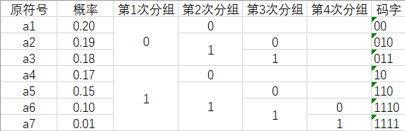  

**改进**  
用原字符出现的次数替代概率，可省去求概率的过程，且在程序中能避免精度问题带来的限制。

**编程实现**  
1. 统计待压缩文件，得到原字符集`A = {a1,a2,..an}`和每种字符出现的次数`Ci`，并用一个数组`Arr`存放下来
2. 将数组`Arr`按出现次数递增的顺序排序
3. 编写一个函数将数组`Arr`按算法划分成两个区间，然后进行递归，直至区间内仅有一个元素。这一步，难在如何划分区间。我这里的做法是：**前n项和**。什么意思呢？看下面的示例：

	原符号|出现次数|前n项和`Sn=a1+..+an`
	--|--|--
	a0|0|S0 = 0
	a1|1|S1 = 1
	a2|10|S2 = 11
	a3|15|S3 = 26
	a4|17|S4 = 43
	a5|18|S5 = 61
	a6|19|S6 = 80
	a7|20|S7 = 100

	表格中的`a0`符号是为了算法实现起来方便而添加的辅助符号，类似于哨兵的作用。然后定义一个`half`变量其值为：  
	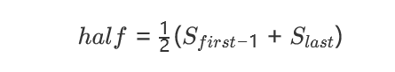  
	定义为 前`first-1`项和 与 前`last`项和 的平均值。
	其中`first`和`last`分别指向区间第一个和最后一个元素。注意，起始时，`first = 1`、`last = Arr.size()-1`。所以，添加的辅助符号起到了防止下越界的作用。  
	准备好前n项和的数组`S`后，就是如何划分的问题了。从`first`开始，找到第一个比`half`值大的元素，然后比较一下，看要不要将该元素放在前一半区间，还是放在后一半区间。确定下来后，对前、后区间递归调用即可。

**最后：树如何写到文件？**   
1. 一般二叉树写入文件：前序遍历，用比特0表示非空结点，用比特1表示空结点。如下图：  
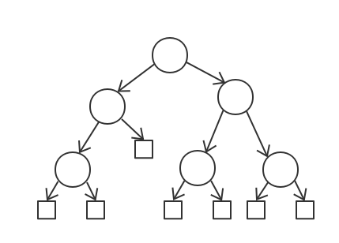  
圆形结点表示非空结点，正方形结点表示空结点。如最左下方的圆形结点，其左右孩子都是正方形结点，都是空结点，所以它为一个叶子结点。上图所示的树被表示为：0001110011011。  
2. 内点皆左右孩子健全的二叉树写入文件：前序遍历，用比特1表示叶子结点，比特0表示内点。示例：  
  

图中所示的树的前序序列为：ABCDFGE，该树被表示为：0100111。该方式相比于第一种方式，使用了更少的bit。  
所以，对于`ShannonTree`采用第一种方式。而`FanoTree`，是通过不断二分来构造的，所以只要是内点就必然有左孩子同时有右孩子，所以采用第二种方式。至于为何这两种方式可以确保在读入的时候准确无误地恢复树的形状，这里不予于解释了，大概沿着递归的思想可以证明其正确性。

## 3.哈夫曼算法
至于Huffman算法，这是我第3次见到这一个算法了。第一次是在离散数学，第二次是在数据结构、第三次是这里的信息论与编码。所以我就不准备再记录了。剩下的，就记录一些杂七杂八的东西吧。   
1. 根据哈夫曼算法，`HuffmanTree`是由一开始的叶子结点森林不断两两合并而来。所以内点皆左右孩子健全，故用上面提到的第二种方式来写入到到文件。  
2. 回答一下前面的一个思考。
    >   一，*step8* 里要解码多少次呢？需不需要在压缩过程中的*step4*、*step5* 之间加一个操作写入统计得到的字符数？为什么？ 

	要不要在压缩的输出文件里头写入原来待压缩的文件的总字符数？   
	我的回答是：很大概率不用，但有些情况下要。  
	3种算法均是不等长编码。文件的最小单元是字节。当我们往文件里头写完树（包括形状与每个叶子结点对应的原符号）、然后又写完了原文件编码之后的内容，此时的总bit数不一定是8的倍数，要补几个bit。我们可以利用这几位bit来使得后面读入内容的过程能正常结束。  
	先上结论：只要码树右臂臂长`len > 7`便可保证待会读入过程可正常结束。  
	**码树的右臂与右臂长`len`**  
	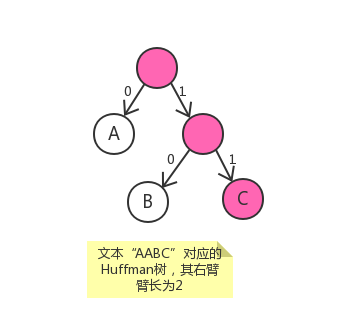  
	如图所示，粉红色结点的那么一条链表，我把其称为是树的右臂，把臂长`len`定义为这条链表上除了根结点之外的结点的数目，即结点总数目-1。
	
	假设我们补全用的bit数是`n`，则`1 <= n <= 7`。另外我程序是用0来表示往左孩子指，1来表示往右孩子指。所以我补全用的是比特1。当`len > 7`，显然有`len > n`。所以当解压缩时读到最后用于补全的比特1的时候，这些比特1会使得一个指针从叶子结点不断往右孩子指。但是`len > n`，所以文件都读完了，该指针还没指到叶子结点。我们利用IO流的状态来正常地结束读入的过程，正常是指不会因为多读这几个补全的bit而多解码了几个码字。  
	当`len <= 7`时，我们就只能往文件里写入原文件大小的信息了。所以我们要尽可能使得码树的右臂长一点，这在3种算法的实现细节里可以注意。嗯，我们还需要能从压缩输出文件那得知该文件是那种方式压缩得到的，是否写入原文件的大小信息。这里我们用压缩输出文件的第1个比特来表示，如0表示没有写入原文件大小，1则是有写入。  

## 4.最后
1. 程序运行截图：   
	1.1 香农编码  
	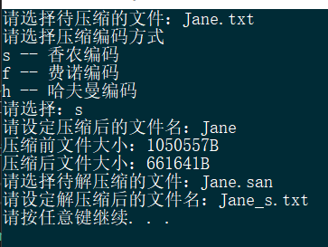   
	1.2 费诺编码    
	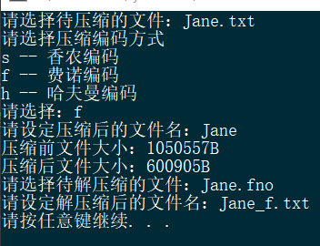  
	1.3 哈夫曼编码  
	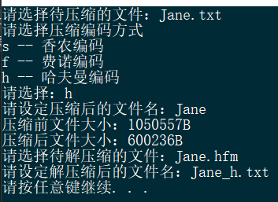  
	1.4 原文件、压缩输出文件、解压缩输出文件  
	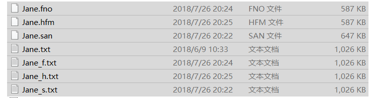  

2. 3种编码方法的对比  
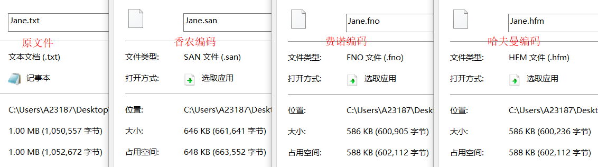  

结果很显然了，哈夫曼编码是被证明了的最优的无记忆压缩算法。而且对应的码树满足内点皆左右孩子健全这一性质，因而可用更少的bit来表示。而且编程实现也十分容易。费诺树虽然同样有此性质，但在构建树的过程中要不断递归，较为耗时。且非递归实现比较麻烦(我就没写出来，😂)。  
关于香农编码、费诺编码在什么情况下取得最佳，详见冯书。

TODO  
- [x] Compress类
- [x] cout << tree (不做了)
- [x] compress -s -tree infile -o outfile (不做了)
- [x] bug.txt AABC
  - [x] obitstream's write
    - [x] namespace (不做了)
  - [x] ibitstream's read
- [x] CompressTask
- [x] uint64_t 还是 size_t
- [ ] 文档
- [ ] hzip，打包压缩文件夹